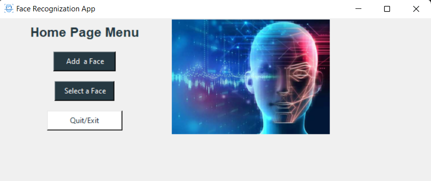
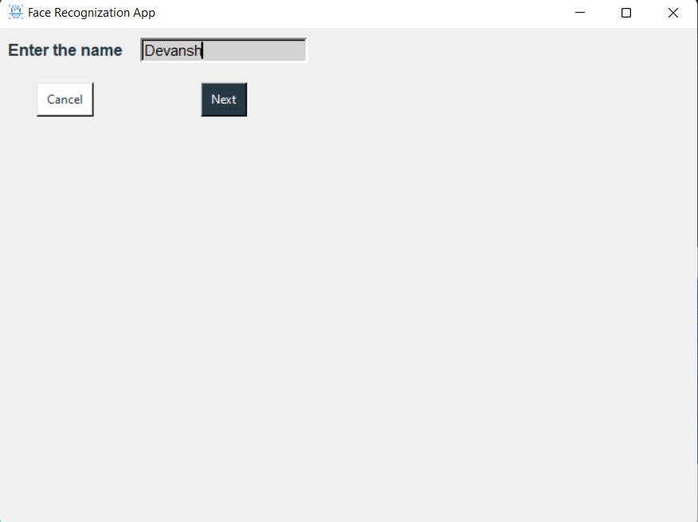
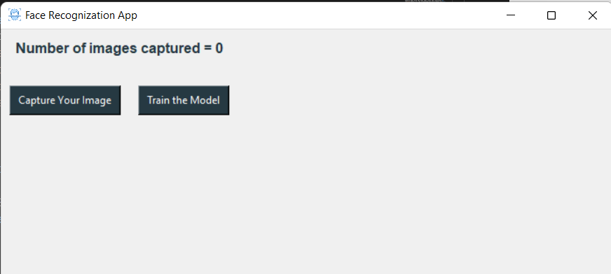
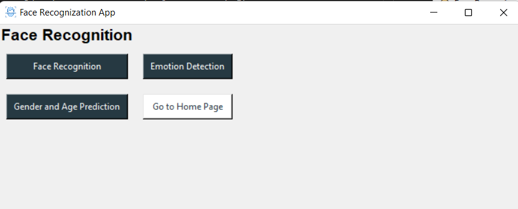
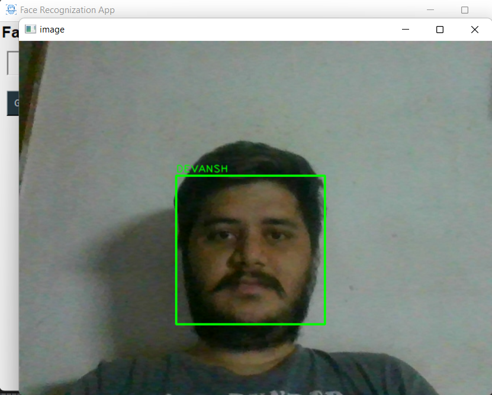
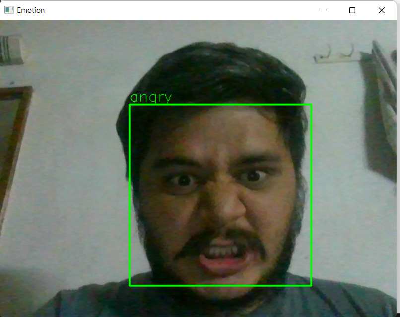
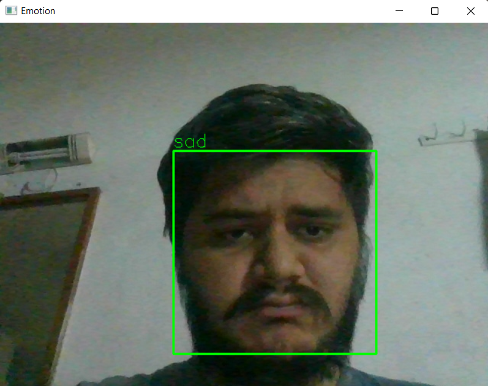

# **Face Recogniton GUI-APP**
>## A very Simple Gui app for Face Detection 

  - Captures User's Facial Data
  - Build Face Classifier on user's face data
  - Detectes the face of user

#  Additional Features!

  - Added Emotion detection
  
  
# Installation

1 : Install the requirements .

```sh
$ pip install -r  requirements.txt
```

2 : Install python version < 3.10 use of for tensorflow


3 : Run The App 

```sh
$ python app-gui.py
```
# APP GUI

### Home Page


### Add a User <br>
Add the user you want to train a classifier for <br>


Data Set Link - https://www.kaggle.com/jonathanoheix/face-expression-recognition-dataset
<br>


### Capture Data and Train Classifier<br>
Capture Data From the face then train the classifier<br>
<br>

### Users List<br>
List of all the users<br>
<br>

### Recognition <br>
A webcam window will popup and start recognition proccess<br>
<br>
><br>
><br>
## **Emotions**
><br>
><br>


<br><br>
Made By ❤ : [Devansh Bhatt](mailto:devanshbhatt1805@gmail.com)<br>


